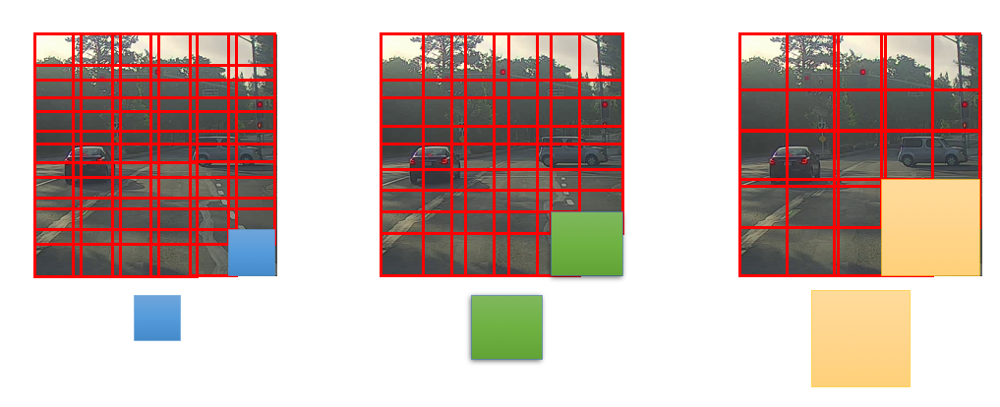
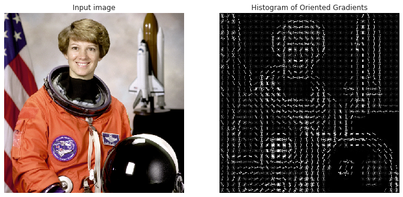
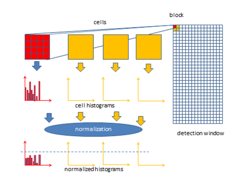
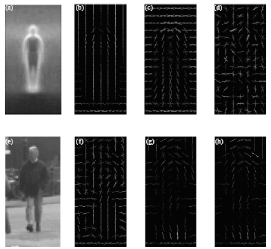

# Person Detection using HOG Feature and SVM Classifier


---------------------------------------------------------------------------------------------------------------------------
### Tested 

```python3 visualize_image.py``` 


## Usage
* install image dataset from my Googledrive
[Image Dataset](https://drive.google.com/open?id=1vLts74OSo7nGaK3gcPB_waBzC-crMTYE) 
  
```git clone https://github.com/RashadGarayev/PersonDetection``` 

```cd PersonDetection``` 


```python3 train_SVM.py```  

* for real-time person detection :

```python3 visualize_real_time.py```  

-----------------------------------------------------------------------------------------------------------------------

 ## The sliding windows detection algorithm
 
 In object detection problems, we generally have to find all the possible objects in the image like all the cars in the image, all the pedestrians in the image, all the bikes in the image, etc. To achieve this, we use an algorithm known as Sliding window detection. Let us understand this algorithm.
 * In this algorithm, we choose a grid cell of a specific size. Let us choose the grid cell of size 2x2.
 * We pass the above grid cell through the image and convolute the part of the image in the grid cell and predict the output.
 * Then we slide the grid cell through stride-2 and then convolute the next part of the image.
 * In this way, we go cover the whole image.
 * We repeat the same procedure with different grid cells size.
 




## Histogram of oriented gradients



Histogram of oriented gradients (HOG) is a feature descriptor used to detect objects in computer vision and image processing. The HOG descriptor technique counts occurrences of gradient orientation in localized portions of an image - detection window, or region of interest (ROI).

Implementation of the HOG descriptor algorithm is as follows:

Divide the image into small connected regions called cells, and for each cell compute a histogram of gradient directions or edge orientations for the pixels within the cell.
Discretize each cell into angular bins according to the gradient orientation.
Each cell's pixel contributes weighted gradient to its corresponding angular bin.
Groups of adjacent cells are considered as spatial regions called blocks. The grouping of cells into a block is the basis for grouping and normalization of histograms.Normalized group of histograms represents the block histogram. The set of these block histograms represents the descriptor.

The following figure demonstrates the algorithm implementation scheme:




Computation of the HOG descriptor requires the following basic configuration parameters:

    Masks to compute derivatives and gradients
    Geometry of splitting an image into cells and grouping cells into a block
    Block overlapping
    Normalization parameters

According to (Source : https://lear.inrialpes.fr/people/triggs/pubs/Dalal-cvpr05.pdf) the recommended values for the HOG parameters are:

    1D centered derivative mask [-1, 0, +1]
    Detection window size is 64x128
    Cell size is 8x8
    Block size is 16x16 (2x2 cells)
    
    




